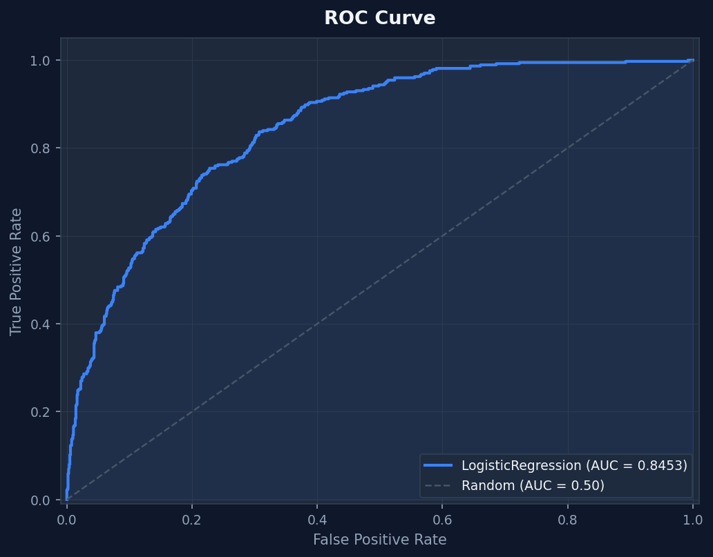
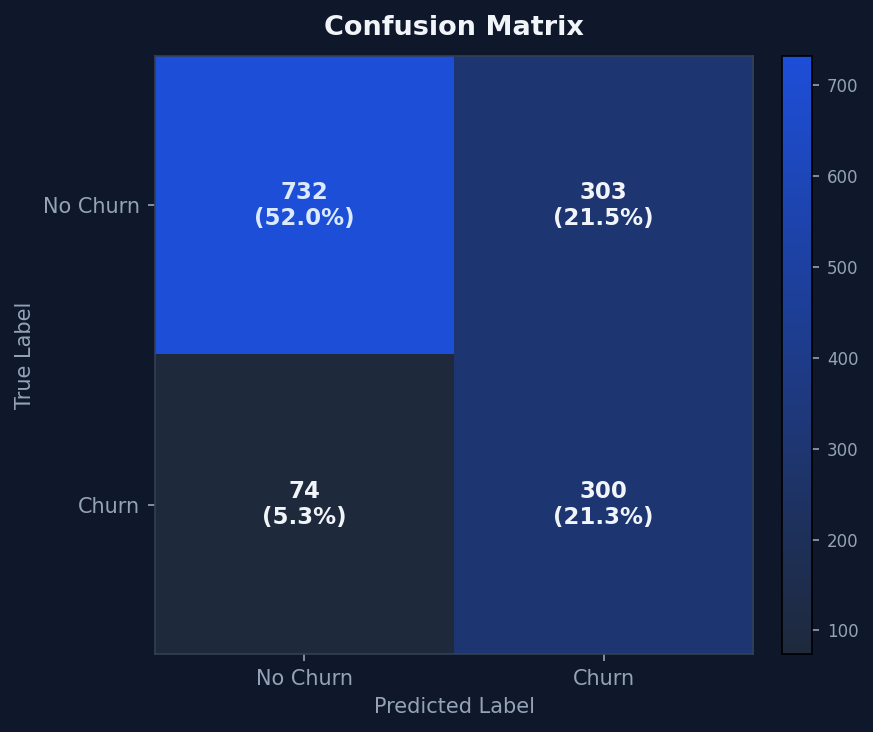
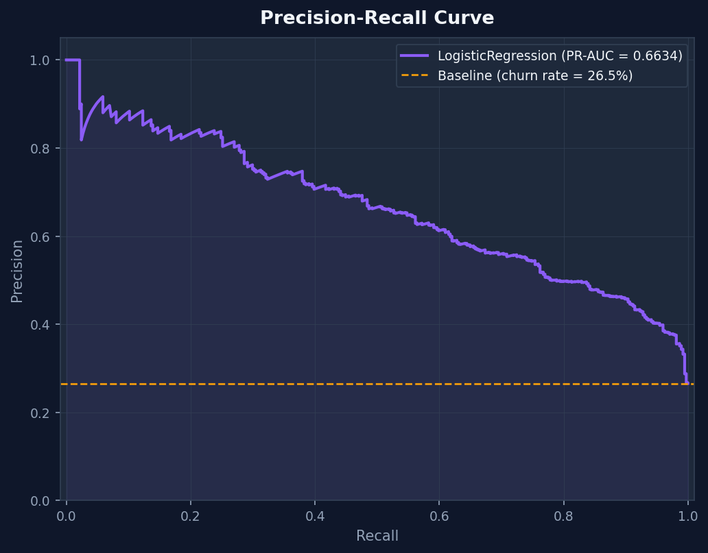
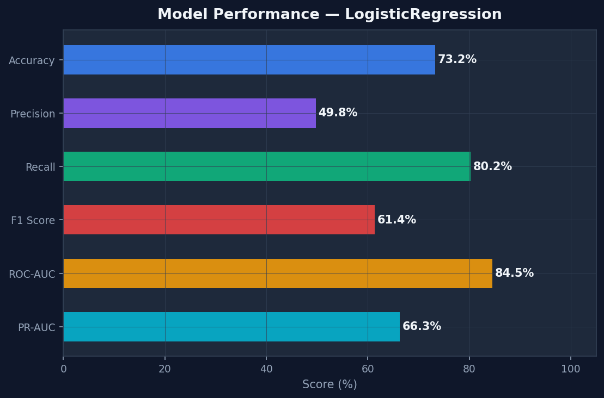
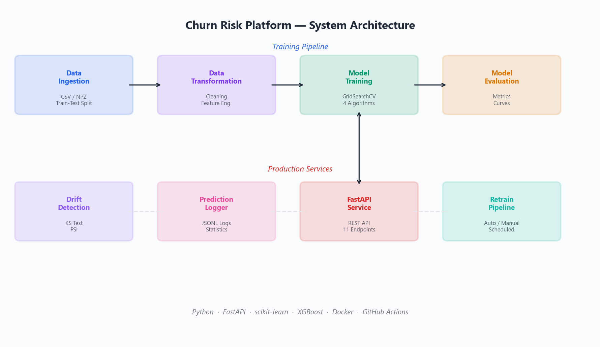
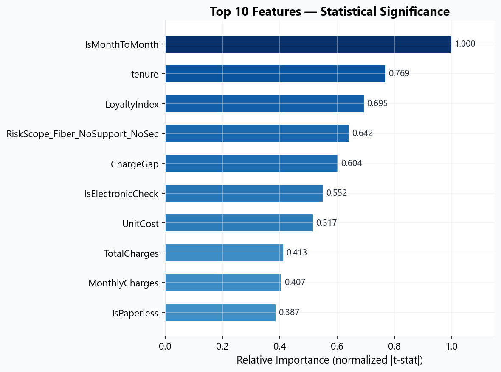

# Churn Risk Platform

End-to-end machine learning platform for predicting customer churn, serving real-time predictions via REST API, monitoring data drift, and supporting automated retraining — designed with production-grade architecture.

[](https://github.com/Krayirhan/churn-risk-platform/actions)
[](https://www.python.org/)
[](LICENSE)
[](tests/)
[](tests/)

> **Core stack:** Python / FastAPI / scikit-learn / XGBoost. The C# API gateway and frontend dashboard are optional companion layers for enterprise integration and demo purposes.

---

## Quick Results

GridSearchCV + Optuna (5-Fold CV) evaluated **6 algorithms** on 7,043 telecom customers. **LogisticRegression** was selected as the production model (selection criterion: `0.7 × Recall + 0.3 × F1`):

| Model | Recall | F1 | Precision | ROC-AUC | Accuracy | Ağırlıklı Skor |
|-------|-------:|---:|----------:|--------:|--------:|---------------:|
| **LogisticRegression** ★ | **80.2%** | **0.6141** | **49.8%** | **0.8453** | **73.24%** | **0.7457** |
| XGBClassifier | 73.3% | 0.6164 | 53.2% | 0.8279 | 75.80% | 0.6977 |
| LGBMClassifier | 64.7% | 0.6111 | 57.9% | 0.8365 | 78.14% | 0.6363 |
| RandomForestClassifier | 61.8% | 0.6016 | 58.6% | 0.8331 | 78.28% | 0.6128 |
| CatBoostClassifier | 60.7% | 0.6078 | 60.9% | 0.8389 | 79.21% | 0.6073 |
| GradientBoostingClassifier | 60.2% | 0.6040 | 60.7% | 0.8393 | 79.06% | 0.6023 |

> Decision threshold tuned to **0.40** (default 0.50 → optimized) — missing a churner costs more than a false alarm. Recall prioritized over Accuracy because higher-accuracy models simply predict "no churn" more often.

<details>
<summary>Evaluation charts</summary>
<br/>
<p align="center">
  
  
</p>
<p align="center">
  
  
</p>
</details>

---

## Highlights

- **6-model comparison** with automated hyperparameter tuning (GridSearchCV + Optuna 60 trials)
- **REST API** for single and batch prediction (up to 100 customers/request)
- **Data drift monitoring** in production — KS test & PSI statistical methods
- **Automated retraining** when performance degrades or drift is detected
- **CI/CD pipeline** — lint, test, Docker build, container registry push, GitHub Release
- **158 tests, 75% coverage** — unit + integration with pytest
- **Interactive frontend dashboard** — real-time system status, model metrics, comparison table, prediction form

---

## Problem & Business Impact

Customer churn directly impacts revenue. In telecom, acquiring a new customer costs **5-7x more** than retaining an existing one. Most companies identify churned customers **after** they leave — when it is too late.

| Impact Area | Before | After (with this platform) |
|-------------|--------|---------------------------|
| **Churn Detection** | Reactive — noticed after customer leaves | Proactive — flagged 30+ days before churn |
| **Retention Campaigns** | Batch, untargeted — low ROI | Precision-targeted to high-probability churners |
| **Revenue Protection** | Lost revenue seen in quarterly reports | Real-time risk scoring enables immediate action |
| **Operational Cost** | Manual analysis by data team (days) | Automated pipeline — train, predict, monitor in minutes |

---

## Architecture

<p align="center">
  
</p>

```
Raw CSV ─> Ingestion ─> Feature Engineering (10 features) ─> GridSearchCV ─> Evaluation
                                                                  |
                                                           artifacts/
                                                       model.pkl + preprocessor.pkl
                                                                  |
                  ┌───────────────────────────────────────────────┼──────────────────┐
                  │                                               │                  │
           FastAPI (Python)                               Drift Detector       Retrain Pipeline
           10 REST endpoints                              KS test + PSI        Auto / Manual
              :8000                                                            Cooldown logic
                  │
       ┌──────────┼──────────┐
       │          │          │
   Python API  C# Gateway  Frontend
    :8000       :5001       :5500
```

**Key design decisions:**
- **Config-driven** — all behavior controlled via YAML files, zero hardcoded values
- **Lazy loading** — model loaded on first prediction, not at startup
- **Feature engineering in pipeline** — 10 business features computed in both training and inference

<details>
<summary>Why a C# API gateway?</summary>

Many enterprise environments standardize on .NET for API integration. The gateway (`backend-csharp/`) demonstrates how the ML service can be integrated into existing enterprise stacks — type-safe request forwarding, API key management, and .NET ecosystem compatibility. The frontend dashboard (`frontend-dashboard/`) provides a browser-based UI for non-technical users (account managers, retention teams) to run predictions without touching curl or Postman.

Both are **optional** — the Python/FastAPI API is fully self-contained.
</details>

---

## Dataset

| Property | Value |
|----------|-------|
| **Source** | [Telco Customer Churn](https://www.kaggle.com/datasets/blastchar/telco-customer-churn) (Kaggle) |
| **Samples** | 7,043 customers |
| **Original features** | 21 |
| **Engineered features** | 29 (10 custom business-logic features) |
| **Target** | `Churn` (binary: Yes / No) |
| **Class imbalance** | ~73% No Churn / ~27% Churn |
| **Train / Test split** | 80% / 20% (stratified) |

Feature engineering includes domain-driven features validated via Chi-Square test, Welch T-Test, and VIF analysis: `IsMonthToMonth`, `LoyaltyIndex`, `RiskScope`, `ChargeGap`, `IsElectronicCheck`, `UnitCost`, `IsPaperless`, `AvgServiceCount`, `TenureBin`, `ChargePerTenure`.

---

## Tech Stack

| Layer | Technology | Purpose |
|-------|------------|---------|
| **ML** | scikit-learn, XGBoost, LightGBM, CatBoost | GridSearchCV + Optuna, 6 algorithms, SMOTE balancing |
| **Data** | pandas, NumPy | Feature engineering, data cleaning |
| **API** | FastAPI + Uvicorn | Async REST, auto-docs, Pydantic validation |
| **Statistics** | SciPy | KS test, PSI for drift detection |
| **Gateway** | C# .NET 10 (ASP.NET Core) | Enterprise integration layer (optional) |
| **Frontend** | HTML5, CSS3, JavaScript | Prediction dashboard (optional) |
| **Containers** | Docker, Docker Compose | Multi-container deployment |
| **CI/CD** | GitHub Actions | Lint → Test → Build → Push → Release |
| **Quality** | flake8, black, isort, pre-commit | Enforced style, import sorting |

---

## Installation

```bash
git clone https://github.com/Krayirhan/churn-risk-platform.git
cd churn-risk-platform

# Create virtual environment
python -m venv .venv
source .venv/bin/activate          # Linux/macOS
# .venv\Scripts\Activate.ps1      # Windows PowerShell

# Install dependencies
pip install -r requirements.txt
```

Or use `make`:

```bash
make install        # Production dependencies
make install-dev    # + dev tools (test, lint, format, pre-commit)
```

---

## Usage

### Train

```bash
python main.py --train
# or
make train
```

Runs the full pipeline: Ingestion → Feature Engineering → SMOTE → GridSearchCV + Optuna (6 models) → Threshold Optimization → Evaluation.  
Outputs: `artifacts/model.pkl`, `artifacts/preprocessor.pkl`, `artifacts/metrics.json`

### Serve

```bash
python main.py --serve
# or
make serve
```

API docs: [http://localhost:8000/docs](http://localhost:8000/docs) (Swagger UI)

### Predict (CLI)

```bash
python main.py --predict-inline '{
  "tenure": 2, "MonthlyCharges": 89.10, "Contract": "Month-to-month",
  "InternetService": "Fiber optic", "OnlineSecurity": "No",
  "TechSupport": "No", "PaymentMethod": "Electronic check"
}'
```

### Docker (all 3 services)

```bash
docker compose up --build
# or
make docker-up
```

| Service | Port | Description |
|---------|------|-------------|
| Python ML API | `:8000` | FastAPI — training, prediction, monitoring |
| C# API Gateway | `:5001` | ASP.NET Core — enterprise forwarding (optional) |
| Frontend | `:5500` | Web dashboard — visual prediction UI (optional) |

### Makefile Commands

```
make help           Show all available commands
make install        Install production dependencies
make install-dev    Install dev dependencies + pre-commit hooks
make train          Run model training pipeline
make serve          Start FastAPI server
make test           Run all tests
make test-cov       Run tests with coverage report
make lint           Run flake8 lint check
make format         Run black + isort auto-formatting
make docker-up      Start all services via Docker Compose
make docker-down    Stop Docker services
make clean          Remove generated artifacts and cache
```

---

## API Reference

### Single Prediction

```bash
curl -X POST http://localhost:8000/predict \
  -H "Content-Type: application/json" \
  -d '{"tenure": 2, "MonthlyCharges": 89.10, "Contract": "Month-to-month",
       "InternetService": "Fiber optic", "OnlineSecurity": "No"}'
```

```json
{
  "prediction": 1,
  "churn_probability": 0.82,
  "risk_level": "Yuksek",
  "customerID": "API_USER"
}
```

### All Endpoints

| Method | Endpoint | Description |
|--------|----------|-------------|
| `GET` | `/` | API information |
| `GET` | `/health` | Service health check |
| `GET` | `/model-info` | Active model name and metrics |
| `GET` | `/model-comparison` | All 6 models ranked by weighted score |
| `POST` | `/predict` | Single customer prediction |
| `POST` | `/predict/batch` | Batch prediction (max 100) |
| `GET` | `/monitor/stats` | Prediction statistics over N days |
| `GET` | `/monitor/drift` | Data drift analysis (KS + PSI) |
| `GET` | `/monitor/health-report` | Full monitoring report |
| `POST` | `/monitor/retrain` | Trigger model retraining |
| `GET` | `/monitor/retrain-history` | Retraining audit log |

---

## Inference Performance

| Metric | Value |
|--------|-------|
| **Median latency** | ~34 ms per prediction |
| **P95 latency** | ~37 ms |
| **Batch size** | Up to 100 customers per request |
| **Cold start** | ~2s (model loading on first request) |

Measured on a standard development machine (Python 3.10, no GPU). Latency includes feature engineering + preprocessing + model inference.

---

## Model Explainability

Understanding **why** the model predicts churn is critical for actionable retention decisions.

<p align="center">
  
</p>

| Rank | Feature | Business Interpretation |
|------|---------|------------------------|
| 1 | **IsMonthToMonth** | Month-to-month contracts churn ~2x more |
| 2 | **tenure** | Customers under 12 months are highest risk |
| 3 | **LoyaltyIndex** | `log1p(tenure)` — low loyalty = disengagement |
| 4 | **RiskScope** | Fiber optic + no security + no tech support |
| 5 | **ChargeGap** | Gap between current and average charges |
| 6 | **IsElectronicCheck** | Electronic check users churn 2.3x more |

<details>
<summary>SHAP (planned)</summary>

SHAP values for per-prediction explanations are on the roadmap. This will enable showing individual customers **which specific factors** drive their churn risk — e.g., "This customer's risk is 82% because of month-to-month contract (+0.15), low tenure (+0.12), and electronic check payment (+0.08)."
</details>

---

## Security

| Feature | Implementation |
|---------|---------------|
| **API Key Auth** | `X-API-Key` header — enabled via `API_KEY` env var |
| **Rate Limiting** | Sliding window — 100 requests/60s per IP (configurable via `RATE_LIMIT_MAX`, `RATE_LIMIT_WINDOW`) |
| **CORS** | Configurable allowed origins via `CORS_ORIGINS` env var |
| **Input Validation** | Pydantic models with type checking and constraints |
| **Error Handling** | Custom exception handler — no stack traces in API responses |

```bash
# Enable security features
export API_KEY="your-secret-key"
export RATE_LIMIT_MAX=100
export CORS_ORIGINS="https://yourdomain.com"
```

---

## Observability

| Layer | What is logged | Storage |
|-------|---------------|---------|
| **Application** | Training steps, errors, warnings, model selection | `logs/` (timestamped files) |
| **Predictions** | Every prediction with input hash, probability, risk level | `logs/predictions/` (daily JSONL) |
| **Drift** | Feature-level KS/PSI scores, drift alerts | `logs/` + `/monitor/drift` endpoint |
| **Model Metrics** | Accuracy, F1, Recall, Precision, ROC-AUC, PR-AUC | `artifacts/metrics.json` |
| **Retraining** | Trigger reason, old/new metrics, timestamp | `/monitor/retrain-history` endpoint |

---

## Monitoring & Drift Detection

| Method | Applies To | Threshold | What It Detects |
|--------|-----------|-----------|-----------------|
| Kolmogorov-Smirnov test | Numerical features | p < 0.05 | Distribution shift in tenure, charges |
| Population Stability Index | Categorical features | PSI > 0.2 | Category proportion changes |

```bash
curl http://localhost:8000/monitor/drift          # Check drift status
curl http://localhost:8000/monitor/stats?days=7   # Prediction stats (last 7 days)
curl -X POST http://localhost:8000/monitor/retrain?force=true  # Force retraining
```

---

## Project Structure

```
churn-risk-platform/
├── app.py                          # FastAPI REST API (11 endpoints)
├── main.py                         # CLI entry point (train/predict/serve/monitor)
├── Makefile                        # Task automation (make train, test, lint, serve)
├── pyproject.toml                  # PEP 621 metadata + tool config
├── Dockerfile                      # Multi-stage Python container
├── docker-compose.yml              # 3-service orchestration
│
├── src/                            # Core application code
│   ├── components/
│   │   ├── data_ingestion.py       #   CSV/NPZ loading, stratified split
│   │   ├── data_transformation.py  #   Cleaning, feature engineering, ColumnTransformer
│   │   ├── model_trainer.py        #   GridSearchCV + Optuna with 6 algorithms + SMOTE
│   │   ├── model_evaluation.py     #   Metrics, ROC/PR curves, confusion matrix
│   │   ├── drift_detector.py       #   KS test + PSI drift detection
│   │   ├── prediction_logger.py    #   JSONL daily prediction logging
│   │   └── model_monitor.py        #   Performance tracking + alerts
│   ├── pipeline/
│   │   ├── train_pipeline.py       #   Ingestion → Transform → Train → Evaluate
│   │   ├── predict_pipeline.py     #   Single/batch inference + risk classification
│   │   └── retrain_pipeline.py     #   Auto retraining with cooldown
│   ├── utils/common.py             #   YAML/JSON loaders, serialization helpers
│   ├── exception.py                #   Custom exception with traceback
│   └── logger.py                   #   Timestamped structured logging
│
├── configs/                        # All behavior is config-driven (YAML)
│   ├── config.yaml                 #   Paths, split ratio, target column
│   ├── model_params.yaml           #   Hyperparameter grids (6 algorithms)
│   ├── monitoring.yaml             #   Drift thresholds, retrain triggers
│   └── processing.yaml             #   Column types, scaling, encoding
│
├── tests/                          # 158 tests, 85% coverage
│   ├── unit/                       #   12 test files (components, pipeline, API)
│   └── integration/                #   End-to-end pipeline tests
│
├── notebooks/
│   └── 01_analysis_and_engineering.ipynb
│
├── backend-csharp/                 # [Optional] C# .NET API Gateway
├── frontend-dashboard/             # [Optional] Web prediction UI
├── artifacts/                      # Generated: model.pkl, preprocessor.pkl, metrics.json
├── data/raw/                       # Source dataset (churn.csv)
├── docs/                           # API.md, ARCHITECTURE.md, DEPLOYMENT.md
└── logs/                           # Application + prediction logs
```

---

## Testing

```bash
make test           # Run all tests
make test-cov       # With coverage report
```

| Module | Tests | Coverage |
|--------|------:|----------|
| Data Ingestion | 15 | 77% |
| Data Transformation | 18 | 91% |
| Model Trainer | 20 | 59% |
| Model Evaluation | 12 | 96% |
| Predict Pipeline | 15 | 62% |
| Drift Detector | 18 | 92% |
| API (app.py) | 20 | 61% |
| Integration | 10 | — |
| **Total** | **158** | **75%** |

---

## CI/CD

**CI** (every push to `main` / `develop`):
```
flake8 lint → pytest + coverage → C# build → Docker build + smoke test
```

**CD** (on `v*.*.*` tag):
```
CI gate → Docker build → Push to ghcr.io → GitHub Release
```

---

## Configuration

All behavior is controlled via YAML — no hardcoded values.

| File | Purpose |
|------|---------|
| `configs/config.yaml` | Data paths, train/test split, target column |
| `configs/model_params.yaml` | Hyperparameter grids for 6 algorithms |
| `configs/monitoring.yaml` | Drift thresholds, retrain triggers |
| `configs/processing.yaml` | Column types, imputation, scaling, encoding |

---

## Roadmap

- [x] 6-model comparison with GridSearchCV + Optuna (60 trials) + SMOTE
- [x] FastAPI inference service (11 endpoints, Swagger docs)
- [x] 10 custom feature engineering features
- [x] Data drift monitoring (KS test + PSI)
- [x] Automated retraining pipeline with cooldown
- [x] Prediction logging (daily JSONL)
- [x] CI/CD with GitHub Actions
- [x] Docker multi-container deployment
- [x] C# API Gateway + Frontend Dashboard
- [x] Dynamic model comparison table in frontend
- [x] Recall-optimized threshold (0.40) via threshold sweep
- [x] 158 tests, 75% coverage
- [x] Security: API key auth, rate limiting, CORS
- [ ] SHAP values for per-prediction explanations
- [ ] Real-time drift dashboard (Grafana)
- [ ] A/B testing framework for model comparison
- [ ] Model registry with versioning (MLflow)
- [ ] Kubernetes deployment manifests
- [ ] Scheduled retraining (cron / APScheduler)
- [ ] Alerting on drift (Email / Slack)

---

## License

MIT — see [LICENSE](LICENSE).

---

## Contributing

See [CONTRIBUTING.md](CONTRIBUTING.md) for guidelines.

```bash
make install-dev    # Dev dependencies + pre-commit
make test           # Before submitting a PR
make lint           # Code quality check
make format         # Auto-format with black + isort
```

---

## Contact

**Muhsin Furkan Turan**

[](https://github.com/Krayirhan)
