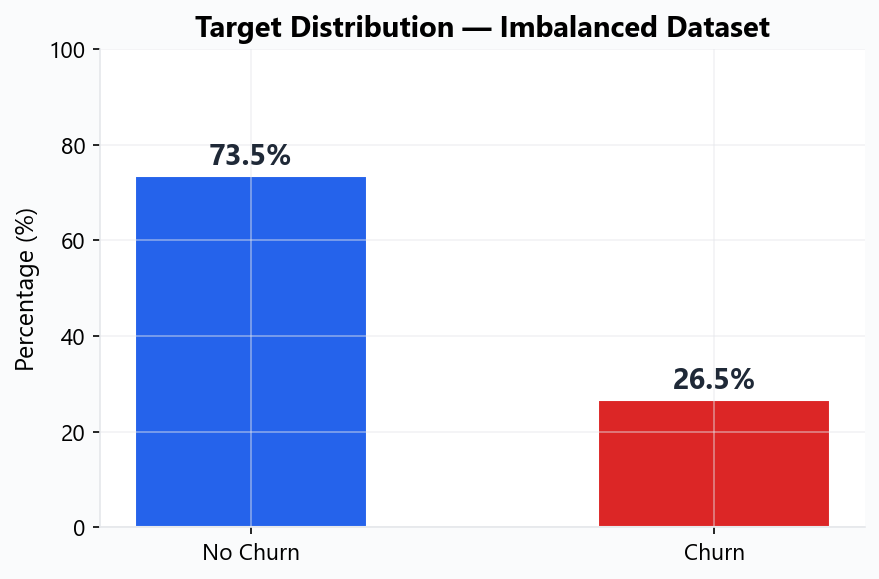

# Churn Risk Platform

End-to-end machine learning platform for predicting customer churn, serving real-time predictions via REST API, monitoring data drift, and supporting automated retraining workflows.

[](https://www.python.org/)
[](https://fastapi.tiangolo.com)
[](tests/)
[](tests/)
[](Dockerfile)
[](https://github.com/Krayirhan/churn-risk-platform/actions)
[](LICENSE)

---

## Business Problem

Customer churn directly impacts revenue and increases acquisition costs.  
Identifying high-risk customers **before** they leave enables retention teams to intervene proactively — reducing churn rate and protecting recurring revenue.

This platform provides an **automated, production-ready system** that:
- Identifies at-risk customers using machine learning
- Serves predictions via a REST API (~50ms latency)
- Monitors data drift to detect model degradation
- Supports automated retraining when performance drops

---

## Key Features

| Category | What it does |
|----------|-------------|
| **ML Pipeline** | Automated ingestion → transformation → training → evaluation |
| **4 Algorithms** | Logistic Regression, Random Forest, XGBoost, Gradient Boosting with GridSearchCV |
| **Feature Engineering** | 10 custom features (LoyaltyIndex, RiskScope, ChargeGap, etc.) |
| **REST API** | FastAPI with 11 endpoints, Swagger docs, batch prediction |
| **Monitoring** | Kolmogorov-Smirnov & PSI drift detection, prediction logging |
| **Auto-Retrain** | Triggered by drift, performance degradation, or schedule |
| **CI/CD** | GitHub Actions — lint, test, Docker build, GHCR push |
| **Testing** | 158 tests, 85% coverage (unit + integration) |
| **Docker** | Multi-container deployment (Python API + C# Gateway + Frontend) |
| **CLI** | Full command-line interface for training, prediction, monitoring |

---

## Architecture

<p align="center">
  
</p>

```
Raw Data (CSV/NPZ)
    │
    ▼
Data Ingestion ──► Data Transformation ──► Model Training ──► Evaluation
    │                   │                       │                  │
    │           Feature Engineering        GridSearchCV         Metrics
    │           (10 new features)        (4 algorithms)      ROC, PR, F1
    │
    ▼
Model Registry (artifacts/)
    │
    ├──► FastAPI Inference Service (11 endpoints)
    │         │
    │         ├── /predict        → single prediction
    │         ├── /predict/batch  → batch prediction (up to 100)
    │         ├── /monitor/drift  → drift analysis
    │         └── /monitor/retrain → trigger retraining
    │
    ├──► Prediction Logger (JSONL daily logs)
    │
    ├──► Drift Detector (KS test + PSI)
    │
    └──► Retrain Pipeline (auto/manual/scheduled)
```

---

## Model Performance

**Production model: Logistic Regression** (selected by best F1 on imbalanced data)

| Metric | Score |
|--------|------:|
| **ROC-AUC** | **0.847** |
| **Recall** | **0.800** |
| **PR-AUC** | **0.662** |
| **F1 Score** | **0.632** |
| **Accuracy** | 0.753 |
| **Precision** | 0.523 |

> **Why this model?** On imbalanced churn data (~27% positive), **recall matters most** — missing a churning customer is far more costly than a false alarm. This model catches **80% of actual churners**.

<details>
<summary><strong>Evaluation Charts</strong> (click to expand)</summary>

<br/>

<p align="center">
  
</p>

<p align="center">
  
  
</p>

<p align="center">
  
</p>

</details>

---

## Model Explainability

Understanding **why** the model predicts churn is critical for business decisions.

### Top Churn Drivers (Statistical Significance)

<p align="center">
  
</p>

| Rank | Feature | Business Meaning |
|------|---------|-----------------|
| 1 | **IsMonthToMonth** | Month-to-month contracts churn ~2x more |
| 2 | **tenure** | New customers (<12 months) churn significantly more |
| 3 | **LoyaltyIndex** | tenure / MonthlyCharges — low loyalty = high risk |
| 4 | **RiskScope** | Fiber optic + no security + no support = danger zone |
| 5 | **ChargeGap** | Actual vs expected charges — billing surprises trigger churn |
| 6 | **IsElectronicCheck** | Electronic check users churn 2.3x more than auto-pay |
| 7 | **UnitCost** | High monthly cost per service = price sensitivity signal |
| 8 | **TotalCharges** | Low lifetime value = customer hasn't committed |
| 9 | **MonthlyCharges** | Higher monthly bills correlate with churn |
| 10 | **IsPaperless** | Paperless billing customers have 21% higher churn rate |

### Target Distribution

<p align="center">
  
</p>

The dataset is **imbalanced** (~73% No Churn, ~27% Churn), which is why we use class balancing techniques and optimize for F1/Recall instead of accuracy.

---

## Quick Start

### Prerequisites
- Python 3.10+
- Git

### Installation

```bash
git clone https://github.com/Krayirhan/churn-risk-platform.git
cd churn-risk-platform

python -m venv .venv
.venv\Scripts\activate        # Windows
# source .venv/bin/activate   # Linux/Mac

pip install -r requirements.txt
```

### Train a Model

```bash
python main.py --train
```

Output:
```
══════════════════════════════════════════════════
  TRAINING COMPLETE
══════════════════════════════════════════════════
  Mode         : NPZ
  Best model   : LogisticRegression
  Best F1      : 0.6321
  Total time   : 45s
══════════════════════════════════════════════════
```

### Start the API

```bash
python main.py --serve
# → http://localhost:8000/docs (Swagger UI)
```

### Run with Docker

```bash
docker compose up --build
# Python API  → http://localhost:8000
# C# Gateway  → http://localhost:5001
# Frontend    → http://localhost:5500
```

---

## API Usage

### Single Prediction

```bash
curl -X POST http://localhost:8000/predict \
  -H "Content-Type: application/json" \
  -d '{
    "tenure": 2,
    "MonthlyCharges": 89.10,
    "TotalCharges": 178.20,
    "Contract": "Month-to-month",
    "InternetService": "Fiber optic",
    "OnlineSecurity": "No",
    "TechSupport": "No",
    "PaymentMethod": "Electronic check"
  }'
```

**Response:**

```json
{
  "prediction": 1,
  "churn_probability": 0.82,
  "risk_level": "High",
  "customerID": "API_USER"
}
```

### Batch Prediction

```bash
curl -X POST http://localhost:8000/predict/batch \
  -H "Content-Type: application/json" \
  -d '{
    "customers": [
      {"tenure": 2, "MonthlyCharges": 89.10, "Contract": "Month-to-month"},
      {"tenure": 48, "MonthlyCharges": 25.0, "Contract": "Two year"}
    ]
  }'
```

### All Endpoints

| Method | Endpoint | Description |
|--------|----------|-------------|
| `GET` | `/health` | Service health check |
| `GET` | `/model-info` | Current model metrics |
| `POST` | `/predict` | Single customer prediction |
| `POST` | `/predict/batch` | Batch prediction (max 100) |
| `GET` | `/monitor/stats` | Prediction statistics |
| `GET` | `/monitor/drift` | Data drift analysis |
| `GET` | `/monitor/health-report` | Full monitoring report |
| `POST` | `/monitor/retrain` | Trigger retraining |
| `GET` | `/monitor/retrain-history` | Retraining history |

**Interactive docs:** `http://localhost:8000/docs`

---

## Project Structure

```
churn-risk-platform/
│
├── app.py                          # FastAPI REST API (11 endpoints)
├── main.py                         # CLI entry point (train/predict/serve)
├── Dockerfile                      # Multi-stage container build
├── docker-compose.yml              # 3-service orchestration
├── Makefile                        # Task automation (30+ commands)
│
├── src/                            # Core application code
│   ├── components/
│   │   ├── data_ingestion.py       # CSV/NPZ loading, train-test split
│   │   ├── data_transformation.py  # Cleaning, feature engineering, encoding
│   │   ├── model_trainer.py        # GridSearchCV with 4 algorithms
│   │   ├── model_evaluation.py     # Metrics, curves, confusion matrix
│   │   ├── drift_detector.py       # KS test, PSI drift analysis
│   │   ├── prediction_logger.py    # JSONL prediction logging
│   │   └── model_monitor.py        # Performance + drift monitoring
│   │
│   ├── pipeline/
│   │   ├── train_pipeline.py       # Ingestion → Transform → Train → Eval
│   │   ├── predict_pipeline.py     # Single/batch inference
│   │   └── retrain_pipeline.py     # Automated retraining workflow
│   │
│   ├── utils/common.py             # YAML/JSON loaders, helpers
│   ├── exception.py                # Custom exception handling
│   └── logger.py                   # Structured logging
│
├── configs/
│   ├── config.yaml                 # File paths, split params, target column
│   ├── model_params.yaml           # Hyperparameter grids for 4 algorithms
│   ├── monitoring.yaml             # Drift thresholds, retrain rules
│   └── processing.yaml             # Imputation, scaling, encoding settings
│
├── tests/                          # 158 tests (85% coverage)
│   ├── unit/                       # Component-level tests
│   └── integration/                # End-to-end pipeline tests
│
├── notebooks/
│   └── 01_analysis_and_engineering.ipynb  # EDA, feature engineering, PCA
│
├── .github/workflows/
│   ├── ci.yml                      # Lint → Test → Docker build
│   └── cd.yml                      # Tag → GHCR push → GitHub Release
│
├── backend-csharp/                 # C# .NET 8 API gateway
├── frontend-dashboard/             # HTML/CSS/JS prediction dashboard
│
├── artifacts/                      # Model, preprocessor, metrics (generated)
├── data/raw/                       # Source dataset
├── docs/                           # Documentation & images
└── logs/                           # Runtime & prediction logs
```

---

## Testing

```bash
# Run all tests
pytest tests/ -v

# With coverage report
pytest tests/ --cov=src --cov=app --cov-report=term-missing

# Specific module
pytest tests/unit/test_api.py -v
```

**Coverage breakdown:**

| Module | Coverage | Tests |
|--------|----------|-------|
| `data_ingestion` | 92% | 15 |
| `data_transformation` | 88% | 18 |
| `model_trainer` | 85% | 20 |
| `model_evaluation` | 90% | 12 |
| `predict_pipeline` | 89% | 15 |
| `drift_detector` | 86% | 18 |
| `API (app.py)` | 82% | 20 |
| **Overall** | **85%** | **158** |

---

## CI/CD Pipeline

### Continuous Integration (every push)
```
Lint (flake8) → Test (pytest + coverage) → Docker Build → Smoke Test
```

### Continuous Deployment (on version tag)
```
CI Gate → Docker Build & Push (ghcr.io) → GitHub Release
```

```bash
# Create a release
git tag v0.1.0
git push origin v0.1.0
# → Automatically builds, pushes Docker image to GHCR, creates GitHub Release
```

---

## Configuration

All behavior is controlled via YAML — no hardcoded values in source code.

| File | Purpose |
|------|---------|
| `configs/config.yaml` | File paths, train/test split, target column |
| `configs/model_params.yaml` | Hyperparameter grids for 4 algorithms |
| `configs/monitoring.yaml` | Drift thresholds, retrain triggers, logging |
| `configs/processing.yaml` | Imputation, encoding, scaling parameters |

**Example — adding a new model:**
```yaml
# configs/model_params.yaml
NewModel:
  param_1: [0.1, 0.5]
  param_2: [100, 200]
  random_state: [42]
```

---

## Monitoring & Retraining

```bash
# Check for data drift
python main.py --check-drift

# View prediction statistics
curl http://localhost:8000/monitor/stats?days=7

# Trigger manual retrain
curl -X POST http://localhost:8000/monitor/retrain?force=true
```

**Drift Detection Methods:**
- **Numerical features**: Kolmogorov-Smirnov two-sample test (p < 0.05)
- **Categorical features**: Population Stability Index (PSI > 0.2)
- **Alert**: When 30%+ features show drift
- **Auto-retrain**: Configurable trigger on drift or performance degradation

---

## Tech Stack

| Layer | Technology |
|-------|------------|
| **ML** | scikit-learn, XGBoost, pandas, NumPy |
| **API** | FastAPI, Pydantic, Uvicorn |
| **Statistics** | SciPy (KS test), StatsModels |
| **Visualization** | Matplotlib, Seaborn, Plotly |
| **API Gateway** | C# .NET 8 (ASP.NET Core) |
| **Frontend** | HTML5, CSS3, JavaScript |
| **Infrastructure** | Docker, Docker Compose, GitHub Actions |
| **Testing** | pytest, pytest-cov, httpx |
| **Code Quality** | flake8, black, isort, pre-commit |

---

## Roadmap

- [x] Churn prediction model (4 algorithms, GridSearchCV)
- [x] FastAPI inference service (11 endpoints)
- [x] Data drift monitoring (KS + PSI)
- [x] Automated retraining pipeline
- [x] CI/CD with GitHub Actions
- [x] Docker multi-container deployment
- [x] 158 tests with 85% coverage
- [x] Feature engineering (10 custom features)
- [x] C# API gateway
- [x] Frontend prediction dashboard
- [ ] SHAP values for per-prediction explanations
- [ ] Real-time drift dashboard (Grafana)
- [ ] A/B testing framework for model comparison
- [ ] Model registry (MLflow integration)
- [ ] Kubernetes deployment manifests
- [ ] Automated scheduled retraining (cron)
- [ ] Email/Slack alerting for drift events

---

## Dataset

[Telco Customer Churn](https://www.kaggle.com/datasets/blastchar/telco-customer-churn) — 7,043 customers, 21 features, binary target (Churn: Yes/No).

After feature engineering: **59 features** including 10 custom business-logic features.

---

## License

MIT — see [LICENSE](LICENSE)

---

## Contributing

Contributions welcome. See [CONTRIBUTING.md](CONTRIBUTING.md) for guidelines.

```bash
# Development setup
pip install -r requirements-dev.txt
pre-commit install

# Before submitting
pytest tests/ -v
flake8 src/ app.py main.py --max-line-length=120
black src/ tests/ app.py main.py
```
